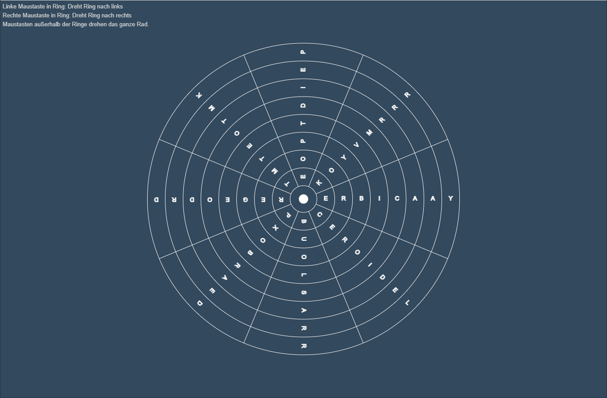

# c't Rätsel 23/2023 Teil 2: Dreh am Rad!

Interaktives Hilfstool, mit dem das Hamsterrad Rätsel aus [ct 23/2023](https://www.heise.de/select/ct/2023/23/2325106080475356764) gelöst werden kann.

Es läuft im Browser. [Starte es](https://nharrer.github.io/ct-raetsel-2023-23_teil-2/drehamrad.html).

## Screenshot

